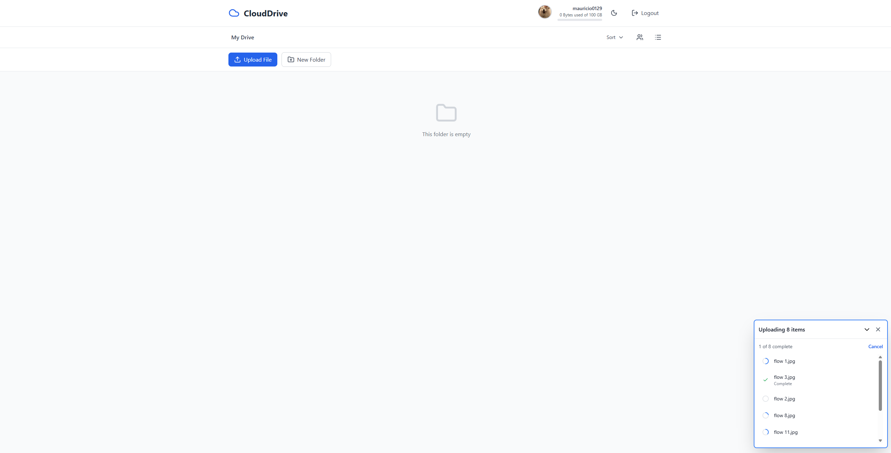
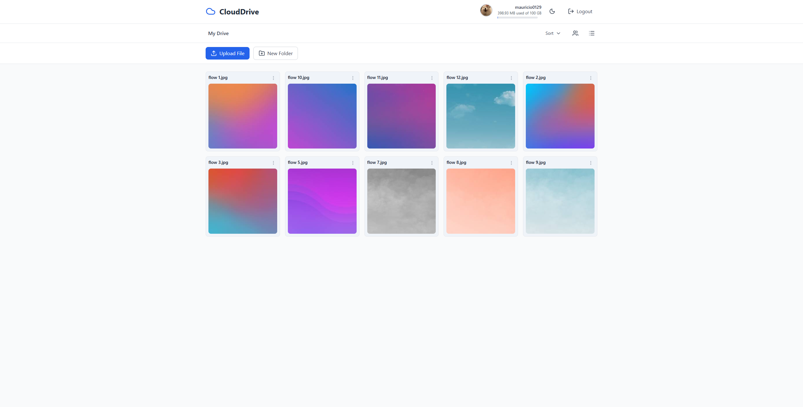
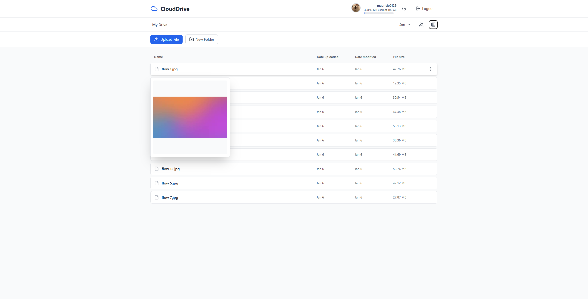
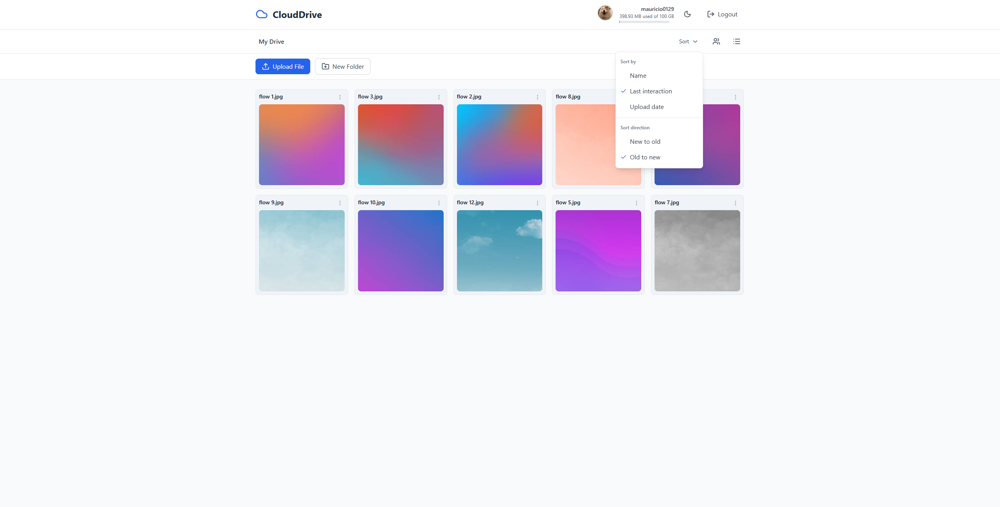

# CloudDrive

A cloud file storage platform built with FastAPI, PostgreSQL, and AWS. CloudDrive supports secure file uploads, sharing, asynchronous image processing, and production-style cloud deployment using S3, Lambda, EC2, and Application Load Balancer.

The project was built to explore how real-world storage systems handle object uploads, asynchronous workloads, security validation, and cloud infrastructure.

---

## 🔗 Live Demo

**Backend API:** https://api.clouddrive.world  
**Live Site:** https://clouddrive.world/  
**API Documentation:** https://api.clouddrive.world/docs

---

## Screenshots









---

# Architecture Overview

CloudDrive separates file transfer, API operations, and background processing to keep user-facing requests fast and scalable.

```
User Browser
      |
      | HTTPS
      v
Frontend (React + Vite + Tailwind)
      |
      | API Requests
      v
Application Load Balancer
      |
      | Health Checked Routing
      v
FastAPI Backend (Docker on EC2)
      |
      |----------------------|
      |                      |
      v                      v
PostgreSQL              AWS Services
(Database)                  |
                            |
              -----------------------------
              |                           |
              v                           v
          S3 Storage                Secrets Manager

              |
              | S3 Event Notifications
              v

        AWS Lambda Processing
              |
              |
      Image Validation + Thumbnails
```

---

# Core Features

## Secure File Uploads

CloudDrive uses AWS S3 presigned URLs so users upload files directly to object storage instead of routing large file transfers through the backend API.

Benefits:
- Reduces API server bandwidth usage
- Allows efficient large-file uploads
- Keeps authentication and authorization handled by FastAPI

Implemented features:
- Parallel multi-file uploads
- File metadata tracking
- Folder organization
- File deletion and renaming
- Image preview generation

---

## Authentication and Authorization

Implemented:

- JWT-based authentication
- bcrypt password hashing
- Password reset workflow
- Protected file operations
- File and folder sharing permissions

Users can:
- Share files and folders
- Assign view/edit permissions
- Access shared resources

---

# Asynchronous Image Processing

Image processing is handled asynchronously through AWS Lambda functions triggered by S3 upload events.

Instead of blocking the upload request while generating thumbnails, the backend confirms the upload immediately and processing occurs in the background.

## ProfilePictureValidator

**Trigger:**

```
S3 upload → profile_photos/original/
```

Responsibilities:

1. Downloads uploaded image
2. Validates actual file type from bytes
3. Rejects malicious or invalid uploads
4. Resizes valid images to 400×400
5. Stores processed output

Security improvement:

The system does not trust file extensions. MIME type detection is performed using file contents to prevent uploads of disguised executable or archive files.

Performance:

Reduced processing time:

```
512ms → 139ms
3.7× improvement
```

---

## VerifyFilesAndCreatePreviews

**Trigger:**

```
S3 upload → files/{user_id}/{file_id}
```

Responsibilities:

1. Extracts file metadata from S3 event
2. Confirms upload completion in PostgreSQL
3. Generates image thumbnails
4. Updates processing state

Configuration:

- Memory: 512MB
- Timeout: 8 seconds
- Runtime: Python 3.12

Performance optimization:

```
6223ms → 1399ms
4.4× improvement
```

Improved through Lambda memory tuning and execution optimization.

Authentication:

Lambda functions communicate with the backend using a shared secret through the `X-Lambda-Secret` header.

---

# Infrastructure

CloudDrive is deployed using:

## AWS EC2

- Dockerized FastAPI application
- Ubuntu server environment
- IAM role-based permissions

## AWS Application Load Balancer

Configured with:

- HTTPS termination
- Health checks
- Multi-AZ support

## AWS S3

Used for:

- User file storage
- Presigned uploads
- Event-driven processing triggers

## AWS Secrets Manager

Used for secure runtime configuration and credential management.

---

# Design Decisions

## Why S3 presigned URLs?

Uploading large files through the backend would consume unnecessary server bandwidth.

Presigned URLs allow clients to upload directly to S3 while the backend continues handling authentication, permissions, and metadata.

---

## Why asynchronous processing?

Thumbnail generation and validation can take longer than normal API requests.

Moving processing into Lambda allows:

- Faster upload responses
- Better user experience
- Independent scaling of background workloads

---

## Why Lambda instead of FastAPI background tasks?

Lambda provides isolated execution triggered by storage events.

This removes image processing work from the API server and prevents long-running tasks from affecting request latency.

---

## Why Docker?

Docker provides consistent deployment between local development and AWS hosting while simplifying dependency management.

---

# Testing

Unit tests are written using pytest.

```
pytest tests/unit_tests
```

Coverage:

```
84%
```

---

# Deployment

CloudDrive is deployed with:

- EC2 running Docker containers
- Application Load Balancer with HTTPS
- S3 object storage
- Lambda event processing
- Secrets Manager configuration
- GitHub Actions CI/CD

Every push triggers automated testing through GitHub Actions.

---

# Local Development

## Prerequisites

- Docker
- AWS account
- PostgreSQL database

## Run Locally

```bash
docker-compose up
```

API:

```
http://localhost:8000
```

Documentation:

```
http://localhost:8000/docs
```

---

# Future Improvements

- [ ] Search functionality
- [ ] File versioning
- [ ] Batch operations
- [ ] Video thumbnail generation
- [ ] Real-time notifications
- [ ] Rate limiting
- [ ] Redis caching layer

---

# Contact

Built by Mauricio Moreno

GitHub:
https://github.com/mauricio0129
